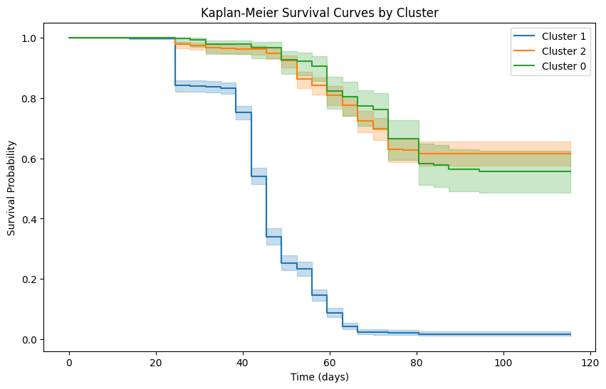

# **Tree Survival Prediction Using Neural Networks and Survival Analysis**

This repository contains the implementation of a machine learning pipeline for predicting tree survival status and estimating survival time. The project leverages clustering, Kaplan-Meier survival analysis, and a neural network model to analyze biological and environmental factors affecting tree survival.

---

## **Table of Contents**
- [Project Overview](#project-overview)
- [Features](#features)
- [Technologies Used](#technologies-used)
- [Installation](#installation)
- [Usage](#usage)
- [Dataset](#dataset)
- [Results](#results)
- [Contributing](#contributing)

---

## **Project Overview**

Tree survival is influenced by multiple factors, including soil characteristics, light availability, and mycorrhizal fungi colonization. This project:
- Predicts the probability of tree survival.
- Classifies trees as `Alive` or `Dead`.
- Estimates median survival time using Kaplan-Meier survival analysis for clusters.

### **Objectives**
1. Use clustering to group trees based on features.
2. Train a neural network to predict survival probability and classify survival status.
3. Provide an estimate of survival time using Kaplan-Meier survival curves.

---

## **Features**
- **Data Preprocessing**:
  - Impute missing values.
  - Normalize features for clustering and neural network training.
- **Clustering Analysis**:
  - Perform K-Means clustering.
  - Analyze clusters using Kaplan-Meier survival curves.
- **Neural Network**:
  - Train a neural network for survival prediction.
  - Output survival probabilities and predicted classes.
- **Survival Time Estimation**:
  - Estimate median survival time for each cluster.

---

## **Technologies Used**
- **Python**:
  - Libraries: `pandas`, `numpy`, `matplotlib`, `seaborn`, `scikit-learn`, `torch`, `lifelines`
- **Jupyter Notebook** for experimentation and visualization.

---

## **Installation**
1. Clone the repository:
   ```bash
   git clone https://github.com/yourusername/tree-survival-prediction.git
   cd tree-survival-prediction
   ```
2. Install dependencies:
   ```bash
   pip install -r requirements.txt
   ```

---

## **Usage**
1. Run the Jupyter Notebook:
   ```bash
   jupyter notebook Tree_Survival_Analysis.ipynb
   ```
2. Follow the notebook steps:
   - Load and preprocess the dataset.
   - Perform clustering and Kaplan-Meier analysis.
   - Train and evaluate the neural network.
   - Predict survival probabilities, classes, and survival time for test data.

---

## **Dataset**

The dataset used in this project is from the following study:
> Wood, Katherine; Kobe, Richard; Ibáñez, Inés; McCarthy-Neumann, Sarah (2023). **Tree seedling functional traits mediate plant-soil feedback survival responses across a gradient of light availability.**  
> Dataset DOI: [10.5061/dryad.xd2547dpw](https://doi.org/10.5061/dryad.xd2547dpw)

### **Acknowledgments**
- All data was collected from a single experiment and is presented in the associated manuscript mentioned above.
- If you use this dataset in your research, please credit the original authors.

---

## **Results**
### **Key Outputs**:
1. **Kaplan-Meier Survival Curves**:
   Visualize survival patterns for each cluster.

   

2. **Neural Network Predictions**:
   - **Accuracy**: `0.84`
   - **Precision**: `0.91`
   - **Recall**: `0.80`

3. **Predicted Survival Time**:
   For a given tree with features `[39.02, 26.48, -1.20, 8.78, 9.56, 0.047]`:
   ```plaintext
   Survival Probability: 0.1200
   Probability of Death: 0.8800
   Predicted Class: Dead
   Estimated Median Survival Time: 45.0 days
   ```

---

## **Contributing**
We welcome contributions to improve this project. To contribute:
1. Fork the repository.
2. Create a new branch:
   ```bash
   git checkout -b feature-branch
   ```
3. Commit your changes:
   ```bash
   git commit -m "Add new feature"
   ```
4. Push to the branch:
   ```bash
   git push origin feature-branch
   ```
5. Submit a pull request.

---
